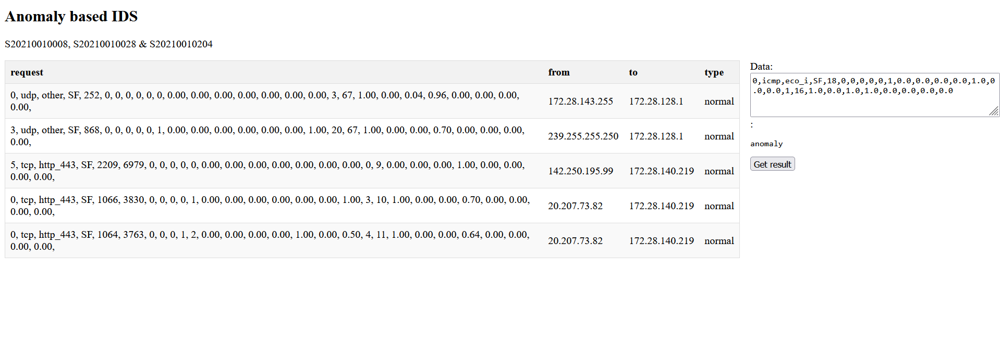

# Real-time Intrusion Detection System Using Deep Learning

This application can monitor live network activity in your system and predict anomalies in the network behaviour.

to run:  
```
sudo python3 main.py  
```
In another terminal, run:  
```
cd ./flask_app
flask --app main.py run -h 0.0.0.0  
```
Open browser and navigate to localhost:5000  
Browse the internet in the same device and refresh the flask app




Tested on Ubuntu 20.04

For more on IDS, refer [https://github.com/RohanArava/IDS-using-Federated-Reinforcement-Learning](https://github.com/RohanArava/IDS-using-Federated-Reinforcement-Learning)

