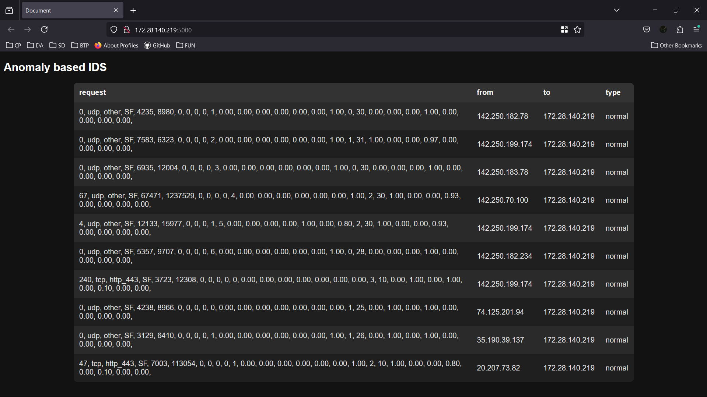

to run:  
```
sudo python3 main.py  
```
In another terminal:  
```
cd ./flask_app
flask --app main.py run -h 0.0.0.0  
```
Open browser and navigate to localhost:5000  
Browse something in another browser (from this host) and refresh the flask page
